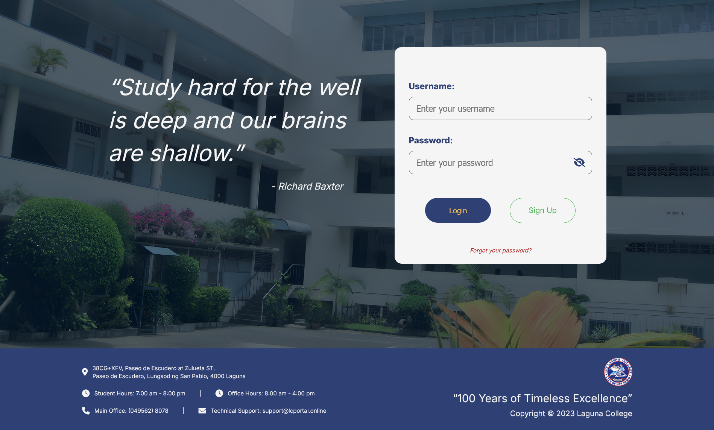
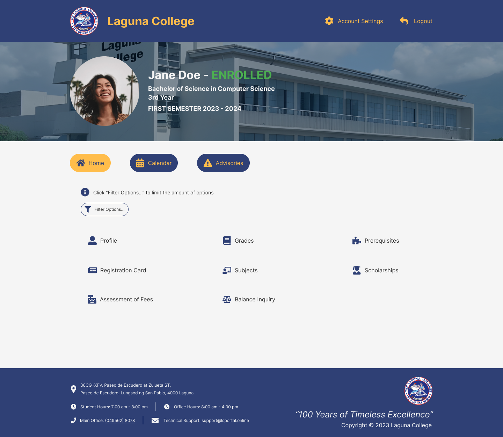
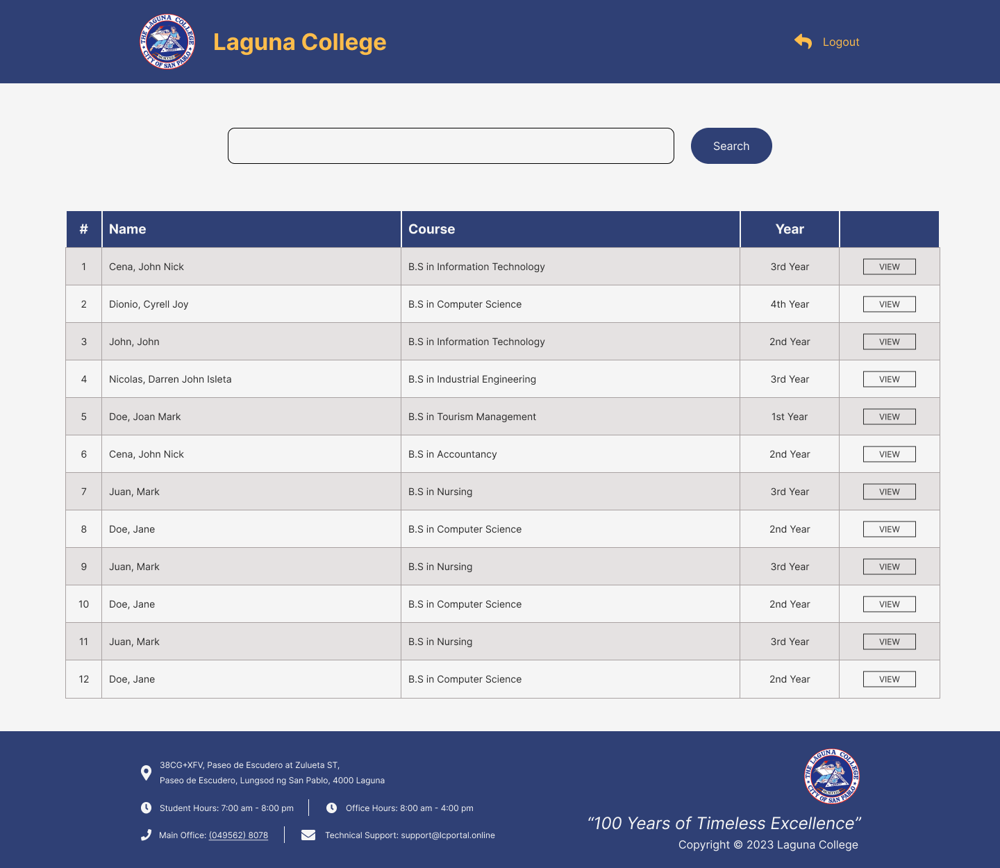

# LC School Portal 🎓

A web-based student management system designed for colleges. Allows students and admins to manage profiles, grades, subjects, and enrollment processes efficiently.

---

## 🧠 Features

- Student profile creation and management
- Grade and subject viewing
- Enrollment registration
- Responsive and intuitive UI for admin/students

---

## 🔧 Tech Stack

- **Frontend**: HTML, CSS, JavaScript
- **Backend**: PHP
- **Database**: MySQL

---

## 📸 Screenshots





---

## 🚀 How to Run Locally

1. **Clone the repository:**
   ```bash
   git clone https://github.com/saciinol/LC-School-Portal.git
   cd LC-School-Portal

2. **Set up your database:**
   Import the SQL dump (if provided) into MySQL (e.g. via phpMyAdmin or CLI).
   Configure db_connection.php with your local database credentials.

3. **Serve with Localhost:**
   Use XAMPP or similar.
   Move the project into your htdocs/ directory.
   Start Apache & MySQL from the XAMPP control panel.

4. **Access in browser:**
   http://localhost/LC-School-Portal
